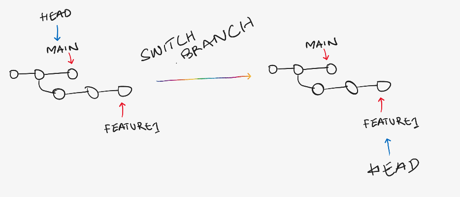
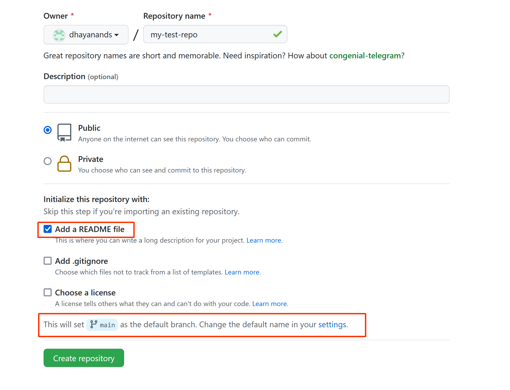
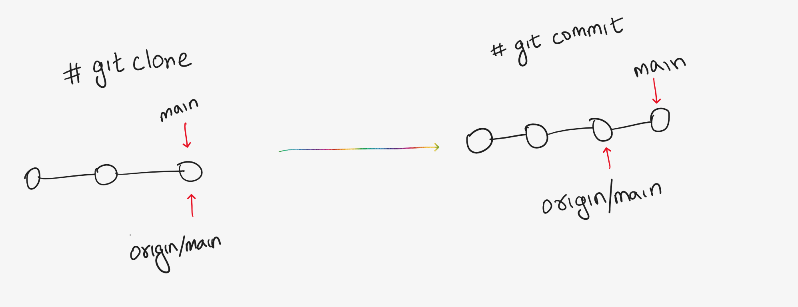
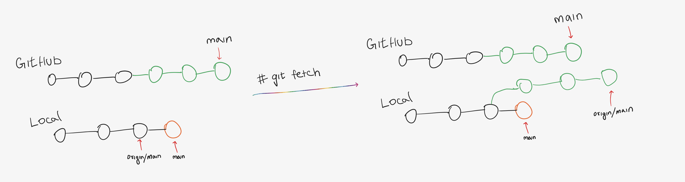
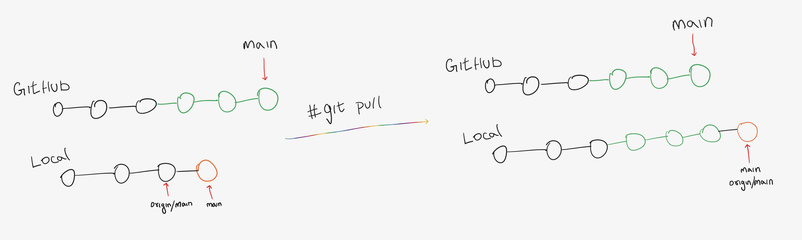
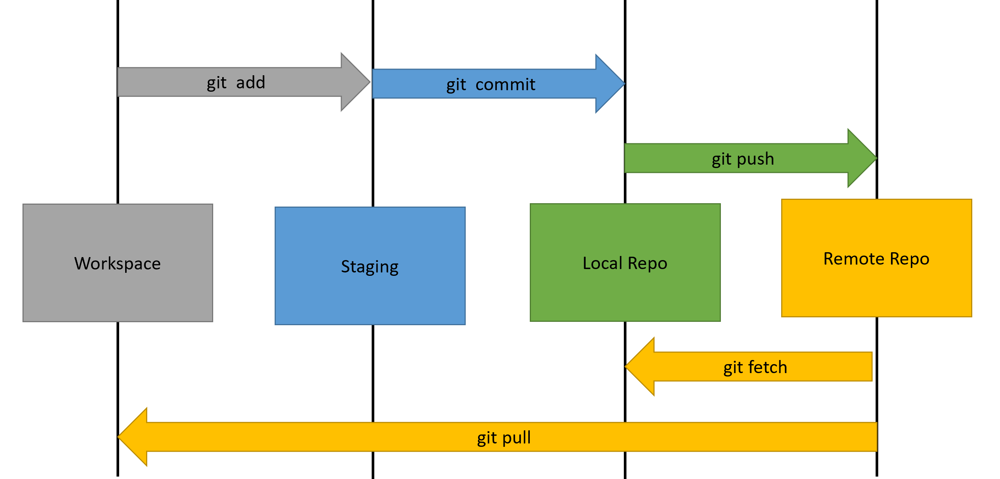

- Git Cheat Sheet
  concept:: [Atlassian Tutorials](https://www.atlassian.com/git/tutorials)
  commands:: [Git Command Reference](https://git-scm.com/docs)
- Git
  tags:: #git, #cheatsheet
  collapsed:: true
	- Basics
	  id:: 618eab3b-1cf9-482d-86d3-220e402c84e3
	  
	  `git init` Initialize repository
	  `git add .` Add all the files in current dir to staging
	  `git restore --staged <file_name>` unstage the file
	  `git commit -m "message"` commit the files
	- Branching
	  
	  `git branch` list all the branches
	  `git branch <branch_name>` create a new branch
	  `git switch <branch_name>` switch to a different branch
	  
	   
	  
	  `git branch -d <branch_name>` delete the branch
	  `git branch -M <branch_name>` rename a branch
	- Merging
	  
	  `git merge <branch_to_merge>` merge a branch to current branch
	  #+BEGIN_CAUTION
	  if the same file was edited on the different branches that you are merging, it is possible to get a [[merge conflict]].
	  #+END_CAUTION
	  #+BEGIN_NOTE
	  If the same file was not modified, then you get a fast forward  merge
	  #+END_NOTE
	- Stash
	  
	  `git stash` save the current changes to stash
	  `git stash pop` apply the recently stashed files
	  `git stash apply`apply the recently stashed files 
	  #+BEGIN_IMPORTANT
	  `stash pop` can be used only to apply stashed files only in ^^current branch^^ and it ^^removes files^^ from the stash list
	  
	  `stash apply` can be used only to apply stashed files ^^across branches^^ and it ^^does not remove files^^ from the stash list so the files can be reused
	  #+END_IMPORTANT
	  `git stash drop stash@{x}` delete a particular stash `x` from list
	  `git stash clear` clear all stashes
	- Restore
	  
	  `git checkout <old_commit_hash>` move the HEAD from the latest commit to an old commit
	  
	  #+BEGIN_TIP
	  This concept is known as ==detached head==
	  
	  This can also be achieved by using reference to HEAD as below
	  `git checkout HEAD~n` move the HEAD to **n** commit before the latest commit
	  
	  To point the HEAD back to the latest commit, switch to the branch with `git switch <branch_name>`
	  #+END_TIP
	  `git restore <file_name>` discard all changes made to a file since last commit
	  `git restore --source HEAD~n <file_name>` restore the file to what it was **n** commits ago
	- Reset
	  
	  `git reset <commit_hash>` go back to a specific commit and delete all the commits done after
	  #+BEGIN_IMPORTANT
	  This command only removes the commits from the history of commits when using `git log` command but the ==changes made to the files are not reverted back== the the specified commit. Instead, the files modified between these commits will be put on the staging dir with the changes made on them.
	  #+END_IMPORTANT
		- `git reset <commit_hash>` go back to a specific commit and delete all the commits done after along with the changes made to the files
	- Revert
	  
	  `git revert <commit_hash>` create a new commit undoing all the changes done till the specified commit
	  
	  #+BEGIN_NOTE
	  `revert` is very similar to `reset` but instead of deleting the commits made, it creates a new commit with all changes discarded. 
	  
	  `reset` will show the commit history like the wrong commits never happened but `revert` will keep record of the commits so we can have them as reference even after discarding the changes made by those commits
	  
	  `revert` is very useful when collaborating with other to work on code so the ==commit history does not mess up during merging==
	  #+END_NOTE
	- Diff
	  
	  `git diff` show all the changes in working directory that are not staged
	  `git diff --staged` show all the changes between staging area and last commit
	  `git diff  commit_x..commit_y` show all the changes between commits
	  `git diff  branch_x..branch_y` show all the changes between branches
- GitHub
  tags:: #github,#cheatsheet
  comment:: all commands are applicable for remote repositories like GitLab & Bit Bucket
  collapsed:: true
	- Clone
	  `git clone <url>` clone a repository and initialize it
	- Remote
	  collapsed:: true
	  
	  `git remote -v` list all the remotes available (remotes are the repos created in GitHub)
	  `git remote add <name> <url>` add a new remote
	  #+BEGIN_TIP
	  `origin` is usually used for the name of the remote
	  #+END_TIP
	  `git remote rename <old_name> <new_name>` rename a remote
	  `git remote remove <name>` delete a remote
	- Before working with push / pull with GitHub, its is important to be aware of below info
	  collapsed:: true
	  #+BEGIN_IMPORTANT
	  ==GitHub renamed the default branch from master to main==. All repositories ==**initialized**== by adding a README file or .gitignore file on GitHub will have main as the default branch
	  
	   
	  
	  But git command still uses master as the default branch. All repositories initialized locally with git will have master as the default branch.
	  
	  in case of conflict, rename the default branch to master / main before pushing to `remote`
	  #+END_IMPORTANT
	- Push
	  collapsed:: true
	  
	  `git push <remote> <remote_branch>` push branch to a remote repo to a remote branch
	  #+BEGIN_NOTE
	  if the remote branch specified does not exist, it will be created
	  #+END_NOTE
	  `git push <remote> <local_branch>:<remote_branch>` push local branch to a remote repo
	  `git push -u origin <branch>` sets upstream of the current branch on local to specified branch on origin
	  
	  #+BEGIN_NOTE
	  setting upstream will connect / map a local branch to a remote branch allowing us to just use just `git push` instead of specifying the remote and branch every time we want to push
	  #+END_NOTE
	- Remote Tracking branch
	  collapsed:: true
	  
	  `git branch -r` shows the remote branch HEAD
	  
	  #+BEGIN_NOTE
	  it is what keeps track of the `remote/main` branch with the local commits
	  
	   
	  
	  #+END_NOTE
	- Fetch
	  collapsed:: true
	  #+BEGIN_NOTE
	  `fetch` updates the `remote tracking branch` with latest updates from remote repo but does not add the change to the current HEAD / working dir or merge the changes
	  #+END_NOTE
	  `git fetch <remote>` get the latest changes from the remote repo
	  `git fetch <remote> <branch>` get the latest changes from the remote repo
	  
	  
	- Pull
	  collapsed:: true
	  
	  #+BEGIN_NOTE
	  `pull` updates the `remote tracking branch` with latest updates from remote repo and also merges the changes to the current HEAD
	  
	  `git pull` = `git fetch` + `git merge`
	  #+END_NOTE
	  
	  `git pull <remote>` git pull the remote repo
	  `git pull <remote> <branch>` git pull a specific branch the remote repo
	  
	  
	  
	  
	  #+BEGIN_WARNING
	  sometimes it is possible to get a [[merge conflict]] during a `git pull`
	  #+END_WARNING
	- Rebase
	  collapsed:: true
	  
	  `git rebase main` rebase current branch to the HEAD of the main branch
	  
	  #+BEGIN_CAUTION
	  DO NOT rebase the branch that others are working on or has been shared with others! 
	  This will mess up the whole history and become a pain to fix 😫
	  #+END_CAUTION
	  
	  `git rebase -i HEAD~n` perform [[interactive rebase]] to re-write the commit history
- Overall flow 
  
  
- Yet to be added
  ```
  git config --global user.name dhayanand
  git config --global user.email dhayanands@hotmail.com
  git config --global credential.helper store 
  git config --global init.defaultBranch main
  
  clone specific branch
  clone --single-branch -b develop https://github.com/sysco-middleware/ansible-dojo-day0-part1
    
    
  git rev-list --count branch-dev
    
  git log --oneline
    
  git log --graph
    
    
  git pull --allow-unrelated-histories
    
    
    
  git rebase
    
    
  git bisect
    
  git blame
  ```
-
-