tags:: #git #github, #cheatsheet

- used to re-write the commit history and below are the options available
  
  `pick` : use the commit
  `reword` : use the commit, but edit the commit message
  `edit` : use the commit but stop for amending
  `squash` : use commit contents but meld it into previous commit with new commit message
  `fixup` : use commit contents but meld it into previous commit and discard the commit message
  `drop` : remove the commit
- Interactive rebase example
	- The plan
	  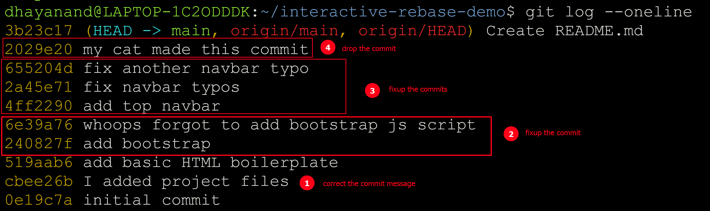
	- change the commit message
	  
	  `git rebase -i HEAD~9` then update the action in 1st window and change the commit message in 2nd window
	  
	  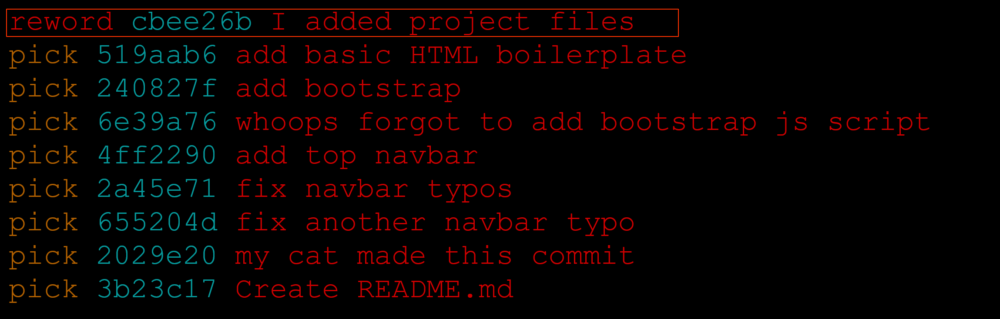 
	  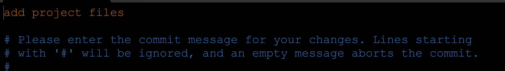
	  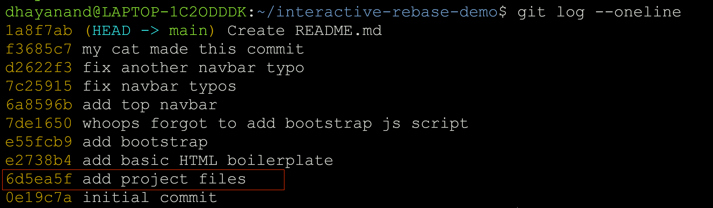
	- perform `fixup` to save the commit content but discard the commit messages
	  
	  `git rebase -i HEAD~9`
	  
	  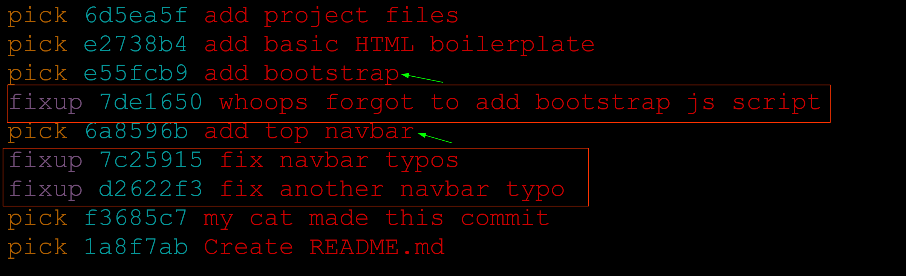
	  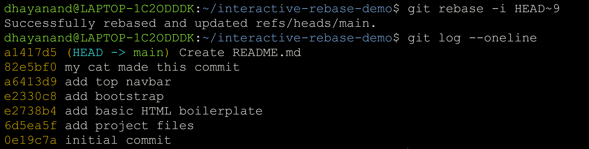
	- completely drop a commit and changes made in that commit
	  
	  `git rebase -i HEAD~6`
	  #+BEGIN_CAUTION
	  With every `fixup` the no of commits gets changed so make sure to use the correct reference to HAED
	  #+END_CAUTION
	  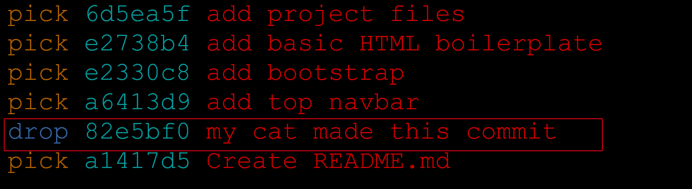 
	  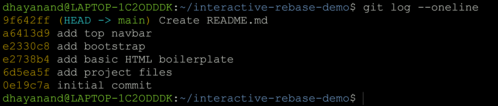
	- `fixup` vs `squash`
	  
	  `squash` prompts for new commit message but `fixup` uses the commit message of the commit that we will merge into
	  
	  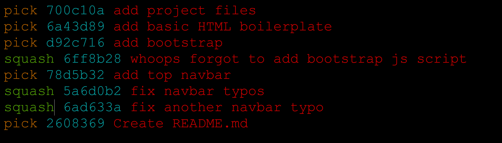 
	  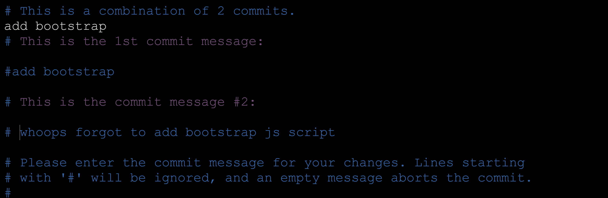
	  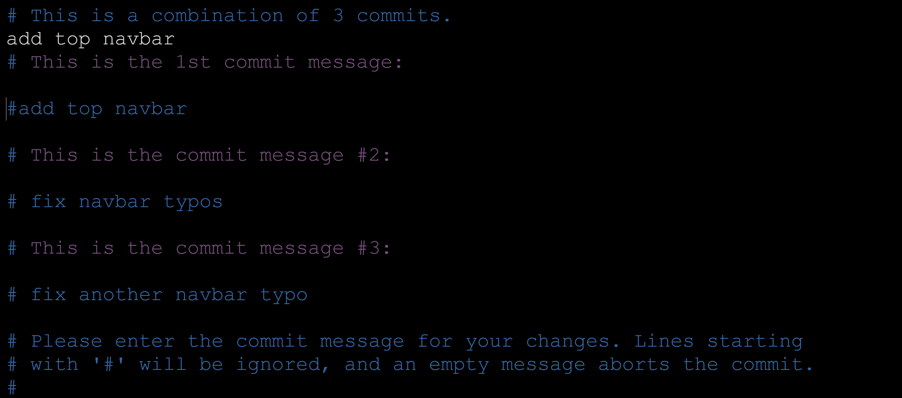